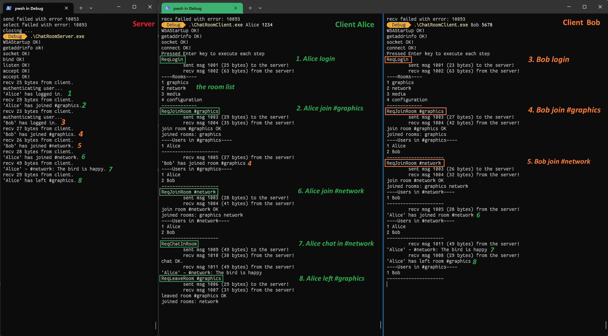

# INFO6016_Project_1 ChatRoom

## Build and Run
1. Open the `INFO6016_Project_1.sln` solution file with Visual Studio.

2. Build the `ChatRoomClient` and `ChatRoomServer` projects using the "Release x64" configuration.

3. Go to `x64/Release` in the project directory and start the server instance by running `ChatRoomServer.exe`.

4. Go to `x64/Release` again and start a client instance (Client A) by running `ChatRoomClient.exe Alice 1234`. Here, 'Alice' is the username, and '1234' is the password. Note that user authentication is not currently implemented; it's for demonstration purposes.

5. Go to `x64/Release` once more and start another client instance (Client B) by running `ChatRoomClient.exe Bob 1234`.

6. Press the Enter key in each client instance (A and B) to proceed through the demonstration steps.

## Features

The following features are demonstrated in the project:

- Joining and leaving a room.
- Joining multiple rooms.
- Sending messages to a room.

Please pay attention to how the ChatRoom handles the broadcasting of actions such as joining a room, leaving a room, and sending messages within the room.

